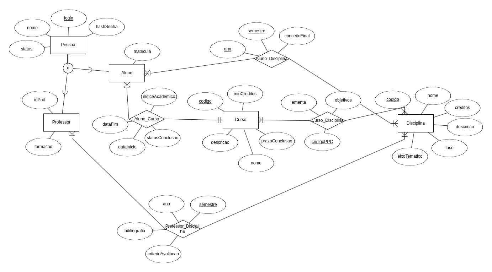
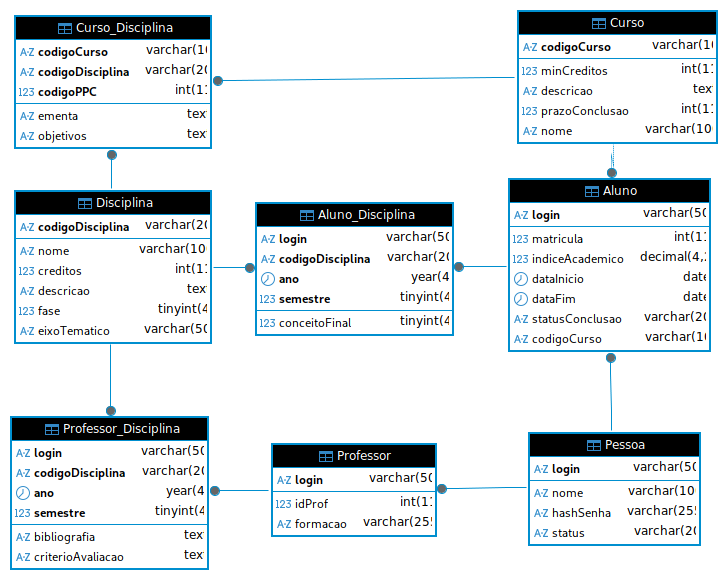

# Campus Manager

- Projeto desenvolvido para modelar e gerenciar informações acadêmicas de uma instituição de ensino, como alunos, professores, cursos e disciplinas.

- A aplicação utiliza Spring Boot, JPA e MariaDB para persistência de dados e organização do domínio acadêmico.


>-  Autora: Luiza Kuze <br>
    > Data: 22/07/2025


##  Modelagem



## Implementação

### DBeaver
 

### JPA

```bash
campusmanager
├── CampusManagerApplication.java
├── entity
│   ├── Aluno.java
│   ├── AlunoDisciplina.java
│   ├── Curso.java
│   ├── CursoDisciplina.java
│   ├── Disciplina.java
│   ├── Pessoa.java
│   ├── Professor.java
│   └── ProfessorDisciplina.java
├── repository
│   ├── AlunoRepository.java
│   ├── AlunoDisciplinaRepository.java
│   ├── CursoRepository.java
│   ├── CursoDisciplinaRepository.java
│   ├── DisciplinaRepository.java
│   ├── PessoaRepository.java
│   ├── ProfessorRepository.java
│   └── ProfessorDisciplinaRepository.java
└── resources
    └── application.properties
```

## Execução local

1. Substituir as informações personalizadas no arquivo "[application.properties](src/main/resources/application.properties)"

    ```bash
    spring.application.name=CampusManager

    spring.datasource.url=jdbc:mariadb://localhost:3306/CampusManager
    spring.datasource.username=${DB_USERNAME}
    spring.datasource.password=${DB_PASSWORD}
    spring.datasource.driver-class-name=org.mariadb.jdbc.Driver

    # mantém os nomes das colunas exatamente como estão no script SQL
    spring.jpa.hibernate.naming.physical-strategy=org.hibernate.boot.model.naming.PhysicalNamingStrategyStandardImpl

    # garantir que o mapeamento bate com o banco
    # spring.jpa.hibernate.ddl-auto=validate
    # spring.jpa.show-sql=true
    ```

2. Para execução: `DB_USERNAME=seu_usuario_local DB_PASSWORD=sua_senha_local ./gradlew bootRun
`. Na primeira execução é necessário povoar a base de dados local (seguir o procedimento da próxima seção). 

## Script de povoamento da base de dados  

- Para popular uma base de dados local idêntica à utilizada no projeto, seguir os passos abaixo:

### 1. Instale o MariaDB 

```bash
sudo apt update
sudo apt install mariadb-server
```

### 2. Clone o repositório

```bash
git clone https://github.com/BCD029008/laborat-rio-spring-boot-jpa-luizakuze.git](https://github.com/luizakuze/Campus-Manager)
cd laborat-rio-spring-boot-jpa-luizakuze
```

### 3. Crie a base de dados `CampusManager`

```bash
sudo mariadb
```

No prompt:

```sql
CREATE DATABASE CampusManager;
exit;
```

### 4. Execute o script de povoamento

```bash
sudo mariadb CampusManager < tools/script.sql
```

### 5. Verifique a criação das tabelas

```bash
sudo mariadb
USE CampusManager;
SHOW TABLES;
```
Pronto! Você deve encontrar uma saída dessa forma:

```bash
+-------------------------+
| Tables_in_CampusManager |
+-------------------------+
| Aluno                   |
| Aluno_Disciplina        |
| Curso                   |
| Curso_Disciplina        |
| Disciplina              |
| Pessoa                  |
| Professor               |
| Professor_Disciplina    |
+-------------------------+
```